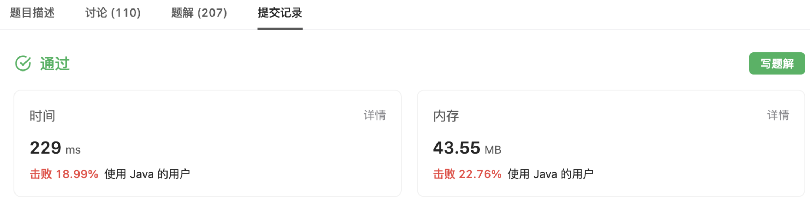

[2390. 从字符串中移除星号](https://leetcode.cn/problems/removing-stars-from-a-string/)

给你一个包含若干星号 * 的字符串 s 。

在一步操作中，你可以：

- 选中 s 中的一个星号。
- 移除星号 左侧 最近的那个 非星号 字符，并移除该星号自身。

返回移除 所有 星号之后的字符串。

注意：

- 生成的输入保证总是可以执行题面中描述的操作。
- 可以证明结果字符串是唯一的。


示例 1：
```
输入：s = "leet**cod*e"
输出："lecoe"
解释：从左到右执行移除操作：
- 距离第 1 个星号最近的字符是 "leet**cod*e" 中的 't' ，s 变为 "lee*cod*e" 。
- 距离第 2 个星号最近的字符是 "lee*cod*e" 中的 'e' ，s 变为 "lecod*e" 。
- 距离第 3 个星号最近的字符是 "lecod*e" 中的 'd' ，s 变为 "lecoe" 。
  不存在其他星号，返回 "lecoe" 。
```
示例 2：
```
输入：s = "erase*****"
输出：""
解释：整个字符串都会被移除，所以返回空字符串。
```

提示：

>- 1 <= s.length <= 10<sup>5</sup>
>- s 由小写英文字母和星号 * 组成
>- s 可以执行上述操作

<hr/>

### 思路一
根据题意结合这道题目是堆栈相关的，因此第一反应是直接用现成的数据结构 stack  
1. 将传入的字符串转为字符数组
2. 遍历数组，遇到星号并且堆栈有元素，则弹出一个。不是星号则压栈
3. 将栈里面的所有元素取出然后反转返回即可

可以写出如下代码：
```java
public String removeStars(String s) {
    Stack<Character> stack = new Stack<>();
    char[] chars = s.toCharArray();
    for(char c : chars) {
        if (c == '*') {
            if (!stack.isEmpty()) {
                stack.pop();
            }
        } else {
            stack.push(c);
        }
    }
    StringBuilder stringBuilder = new StringBuilder();
    while (!stack.isEmpty()) {
        stringBuilder.append(stack.pop());
    }
    return stringBuilder.reverse().toString();
}
```
最终提交结果看来有很大优化空间



### 思路二
其实我们发现，题目主要是星号跟前一个有效元素一起组合移除  
因此，我们可以记录一下有效下标  
当有效下标跟我们遍历的元素索引一致时，说明这个时候没有星号和元素一起被移除  
当有效下标跟我们遍历的元素索引不一致时，说明有星号和元素被移除，这个时候我们需要交换有效下标和当前的非星号元素，这样才能保证我们有效下标后面的值都是无效的  
因此，最终只需要返回有效下标及之前的元素组合即可

可以写出如下代码：
```java
public String removeStars(String s) {
    char[] chars = s.toCharArray();
    int validPos = 0;
    char c;
    for (int i = 0, len = chars.length; i < len; i++) {
        c = chars[i];
        if (c == '*') {
            if (validPos > 0) {
                validPos--;
            }
        } else {
            if (i != validPos) {
                swap(chars, validPos, i);
            }
            validPos++;
        }
    }
    return new String(chars, 0, validPos);
}

private void swap(char[] chars, int validPos, int i) {
    char tmp = chars[validPos];
    chars[validPos] = chars[i];
    chars[i] = tmp;
}
```
可以看到，优化效果是很明显的

